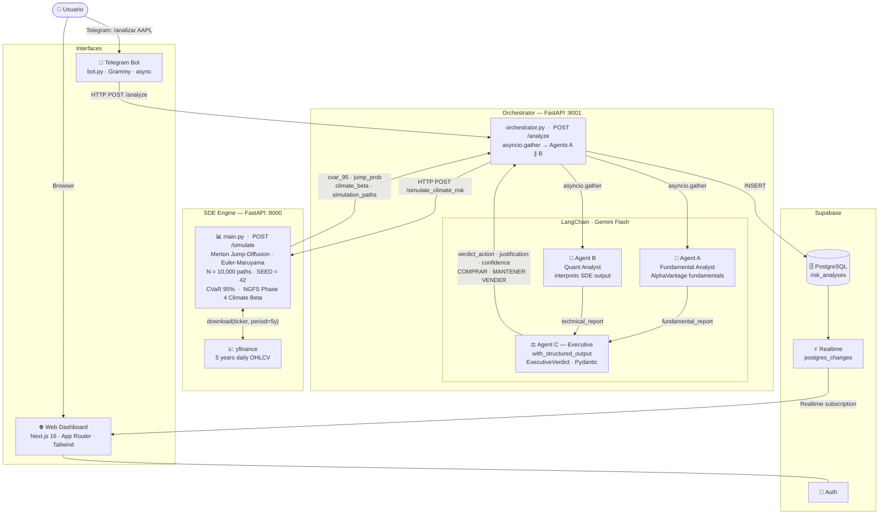

# 🌍 StochastoGreen

[](https://choosealicense.com/licenses/mit/)
[](https://www.python.org/)
[](https://fastapi.tiangolo.com/)
[](https://langchain.com/)
[](https://scipy.org/)

**Climate Transition Risk Simulator** for financial portfolios — combining a rigorous stochastic mathematics engine with a multi-agent LLM orchestration layer.

---

## Family positioning

StochastoGreen is a product of [The Velveteen Project](https://github.com/The-Velveteen-Project), a founder-led Applied Decision Systems Lab. Within the Velveteen family, each product carries a distinct strategic function:

- **The Velveteen Project** — the parent lab and intellectual entry point.
- **EcoAgent** — operational, applied, real-time environmental mapping.
- **StochastoGreen** — *quantitative, austere, research-grade.* Models financial transition risk and behaves like a financial instrument.

Product-facing identity:
- **Amber-on-obsidian** palette — differentiates from the parent's teal.
- **Dense, analytical dashboard** — data-per-pixel deliberately high, following the family guide's explicit permission for domain density.
- **Stochastic vocabulary preserved** — Merton jump-diffusion, CVaR, NGFS Phase 4, Expected Shortfall. No dumbing down.
- **Anti-hype posture** — rigor signaled through evidence, not through terminal theatrics.

A detailed brand-coherence and pruning review lives at [`docs/stochastogreen-pruning-audit.md`](docs/stochastogreen-pruning-audit.md), aligned with the family-level [brand coherence guide](https://github.com/The-Velveteen-Project/the-velveteen-project/blob/main/docs/brand-coherence-pruning-guide.md).

---

## What it does

StochastoGreen evaluates how exposed a stock is to climate transition risk: regulatory shocks, carbon taxes, stranded assets, and physical climate events. Given a ticker, it runs a full quantitative pipeline and returns a structured investment verdict.

The system is deliberately split into two independent layers:

- **Math layer** — a pure Python/NumPy engine with no LLM involvement
- **AI layer** — LLM agents that *interpret and narrate* the math output, never compute it

---

## Architecture



---

## Mathematical Engine

The core is a **Merton (1976) Jump-Diffusion** model implemented from scratch in NumPy/SciPy — no wrappers, no black boxes.

$$d(\ln S_t) = \left(\mu - \tfrac{1}{2}\sigma^2\right)dt + \sigma\, dW_t + J_t\, dN_t$$

| Component | Distribution | Role |
|-----------|-------------|------|
| $dW_t$ | $\mathcal{N}(0, dt)$ | Normal market diffusion |
| $dN_t$ | $\text{Bernoulli}(\lambda \cdot dt)$ | Poisson jump arrivals |
| $J_t$ | $\text{TruncNormal}(-\infty, 0;\, \mu_J, \sigma_J)$ | Downside-only shock magnitude |

**Calibration pipeline:**
1. 5 years of daily log-returns from yfinance
2. 3-sigma filter separates diffusion from jump component (Merton convention)
3. Jump severity calibrated on the negative tail only → left-truncated Normal enforces downside consistency
4. Climate Beta (NGFS Phase 4, 2023) multiplies $(λ, μ_J)$ per sector
5. 10,000 Euler-Maruyama paths, fully vectorized via `np.cumsum` — no Python loops
6. CVaR 95% (Expected Shortfall) on terminal return distribution

**Reproducibility:** all simulations are seeded (`SIMULATION_SEED = 42`). Same input → identical output.

---

## Climate Beta — NGFS Phase 4 Reference

The sector risk multipliers are anchored to NGFS Climate Scenarios Phase 4 (2023), Table 3.1, Disorderly Transition scenario, cross-referenced with MSCI Climate Beta methodology.

| Sector | Beta | Classification |
|--------|------|---------------|
| Energy, Basic Materials | 1.5 | Brown Asset |
| Utilities | 1.4 | Brown Asset |
| Manufacturing | 1.3 | Brown Asset |
| Industrials | 1.2 | Transition |
| Financials, Real Estate | 1.1 | Transition |
| Consumer Staples | 1.0 | Neutral |
| Communication Services | 0.9 | Low exposure |
| Technology, Healthcare, Life Sciences | 0.8 | Green Asset |

---

## Agent Design

The LLM agents operate under strict **Clean Architecture** constraints:

- **Agent A (Fundamental)** — reads AlphaVantage fundamentals (P/E, EBITDA, margins), narrates corporate health
- **Agent B (Quantitative)** — receives SDE output numbers, translates into financial narrative. Never computes math.
- **Agent C (Executive)** — emits a `Pydantic`-validated structured verdict: `action: Literal["COMPRAR", "MANTENER", "VENDER"]`, `justification: str`, `confidence: float`. Uses `with_structured_output()` — if the LLM returns invalid structure, `ValidationError` is raised before it reaches the user.

Agents A and B run in **true parallel** via `asyncio.gather`.

---

## Project Structure

```
├── main.py            # Quantitative SDE Engine (FastAPI, port 8000)
├── orchestrator.py    # Multi-Agent Orchestrator (FastAPI, port 8001)
├── bot.py             # Telegram Bot (event-driven, async)
├── requirements.txt   # Python dependencies
├── docker-compose.yml # Production container orchestration
├── .env.example       # Environment variables template
└── web/               # Next.js dashboard (Supabase, Tailwind)
```

---

## Setup

**Requirements:** Python 3.11+, API keys for AlphaVantage, Google Gemini, Supabase, and Telegram Bot.

```bash
git clone https://github.com/The-Velveteen-Project/StochastoGreen.git
cd StochastoGreen
cp .env.example .env        # fill in your API keys
pip install -r requirements.txt
```

**Run (3 separate processes):**

```bash
# Terminal 1 — SDE Engine
uvicorn main:app --host 0.0.0.0 --port 8000

# Terminal 2 — Orchestrator
uvicorn orchestrator:app --host 0.0.0.0 --port 8001

# Terminal 3 — Telegram Bot
python bot.py
```

**Or with Docker:**

```bash
docker compose up --build
```

---

## Key Design Decisions

**Why Jump-Diffusion?** Climate policy shocks (carbon tax legislation, stranded asset reclassification) are genuinely discontinuous events — not captured by standard GBM. The Poisson jump process models their sudden, non-linear nature. The NGFS "Disorderly Transition" scenario explicitly assumes abrupt policy pivots.

**Why truncated Normal for jump sizes?** The model is calibrated exclusively on negative historical jumps (downside tail). Using a symmetric Gaussian for simulation would generate upside jumps from a downside-calibrated distribution — an internal inconsistency. `TruncNormal(-∞, 0)` enforces that calibration and simulation are on the same domain.

**Why is the LLM not allowed to compute numbers?** LLMs hallucinate numerical results. All risk metrics (CVaR, λ, σ) are computed deterministically in Python and passed to the LLM as context. The LLM's only job is linguistic interpretation. Pydantic enforces the output schema.

---

## Limitations & Future Work

- Climate Beta values are static — a production system would update them from live MSCI/Bloomberg feeds
- No regime-switching model for long-term transition pathways (Hamilton 1989 is a natural extension)
- No portfolio-level correlation modeling (copulas for tail dependence under climate stress)
- yfinance historical data is not cached — same ticker fetched fresh per request

---

*Built by Carlos M. Orrego — The Velveteen Project*
